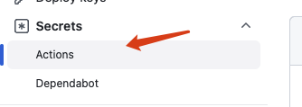
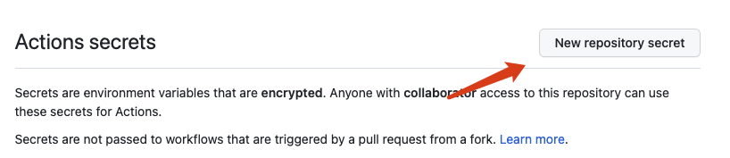
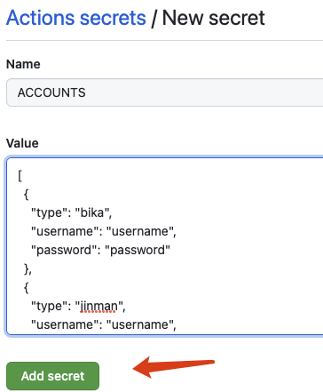
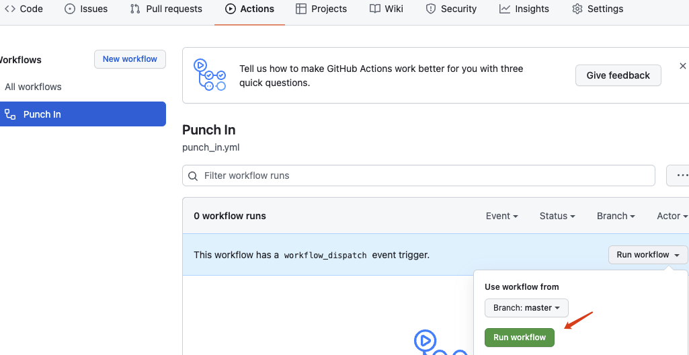
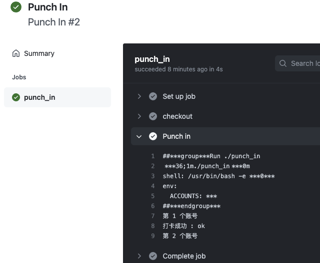

COMIC AUTO PUNCH IN
===================

一款多平台自动打卡工具

## 如何使用

### FORK仓库

去项目的原始仓库点击FORK, 将项目复制到自己的账号中

https://github.com/niuhuan/comic-auto-punch-in


### 设置账号以及密码

#### 在自己的仓库中点击设置并找到 Secrets/Actions



#### 新建密钥



#### 账号密码

将下面的json账号密码修改成自己的, 添加成叫 ACCOUNTS 的密钥并保存



```json
[
  {
    "type": "bika",
    "username": "username",
    "password": "password"
  },
  {
    "type": "jinman",
    "username": "username",
    "password": "password"
  }
]
```

#### 测试运行

如果测试无误每天会自动进行一次签到





## 作者信息

https://github.com/niuhuan

作为一个死宅, 开发很多无广告二次元漫画阅读器, 欢迎去Star。


